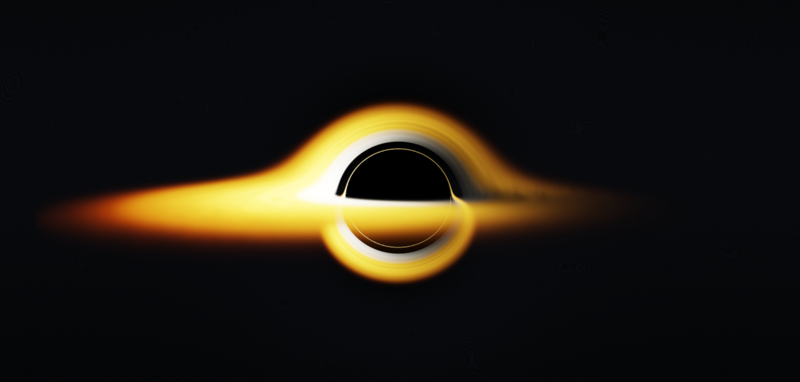

# Black Hole Vulkan Renderer



A real-time black hole simulation that ray-traces photon paths directly to the screen using Vulkan and GLFW.

---

## How it Works

The renderer uses a custom fragment shader (`shader.frag`) to perform per-pixel raymarching. Instead of traveling in straight lines, the path of each light ray (photon) bends due to the immense gravity of the black hole, simulating the effects of General Relativity.

### Gravitational Lensing Mathematics

For every step along the ray's path, the shader calculates the gravitational acceleration using an approximation derived from the geodesic equation for a photon in a Schwarzschild metric:

1. **Specific Angular Momentum ($\vec{h}$):** Calculated as the cross product of the current position ($\vec{r}$) and photon velocity/direction ($\vec{v}$):

   $$
   \vec{h} = \vec{r} \times \vec{v}
   $$

2. **Acceleration ($\vec{a}$):** The bending of the light ray towards the black hole is computed as:

   $$
   \vec{a} = -1.5 R_s \frac{|\vec{h}|^2}{r^5} \vec{r}
   $$

   *(where $R_s$ is the Schwarzschild radius and $r = |\vec{r}|$ is the distance to the singularity)*

3. **Integration:** The velocity and position of the photon are updated at each step using numerical integration:

   $$
   \vec{v}_{new} = \text{normalize}(\vec{v}_{old} + \vec{a} \cdot dt)
   $$

   $$
   \vec{r}_{new} = \vec{r}_{old} + \vec{v}_{new} \cdot dt
   $$

The ray continues until it either crosses the event horizon ($r < R_s$), escapes into the background, or intersects the glowing accretion disk.

### Accretion Disk Physics & Visuals

The accretion disk is modeled with several physical phenomena:
* **Keplerian Differential Rotation:** Inner parts of the disk rotate faster than the outer parts ($\omega \propto r^{-1.5}$).
* **Doppler Beaming (Relativistic Beaming):** Light from the side of the disk moving towards the camera appears brighter and blueshifted, while the receding side is dimmer and redshifted.
* **Procedural Plasma:** Fractional Brownian Motion (fBM) creates organic, chaotic plasma patterns without using textures.
* **Supersampling Anti-Aliasing (SSAA):** A 2x2 SSAA pass smooths out jagged edges and moiré patterns caused by the intense spatial warping.

---

## Requirements

* C++17 compiler (GCC, Clang, or MSVC)
* [Vulkan SDK](https://vulkan.lunarg.com/) (provides Vulkan headers and `glslangValidator` for shader compilation)
* [GLFW 3](https://www.glfw.org/)
* `pkg-config` (for resolving dependencies on Linux)

---

## Linux Build and Run

### 1. Build Compilation

```bash
make
```

This will automatically compile the shaders (`shader.vert` and `shader.frag` to `.spv` format) and build the `bh_vulkan` executable using `g++`.

### 2. Execution

```bash
./bh_vulkan
```

---

## Controls

* **Left Click + Drag**: Rotate camera around the black hole (adjust yaw and pitch)
* **Scroll Wheel**: Zoom in and out (adjust camera radius)

---

## Notes & Performance Tuning

* The application implements a multi-threaded thread pool design for distributing command buffer recording across CPU cores.
* You can adjust the starting `WIDTH` and `HEIGHT` constants in `main.cpp` to change the rendering resolution.
* This project has been upgraded from an initial CPU-only offline renderer (which generated `.ppm` files) to a real-time hardware-accelerated Vulkan renderer. The gravity lensing and physics have been ported and optimized as a per-pixel raymarching process within the fragment shader (`shader.frag`).
* The window title will dynamically update and display the current Frames Per Second (FPS).